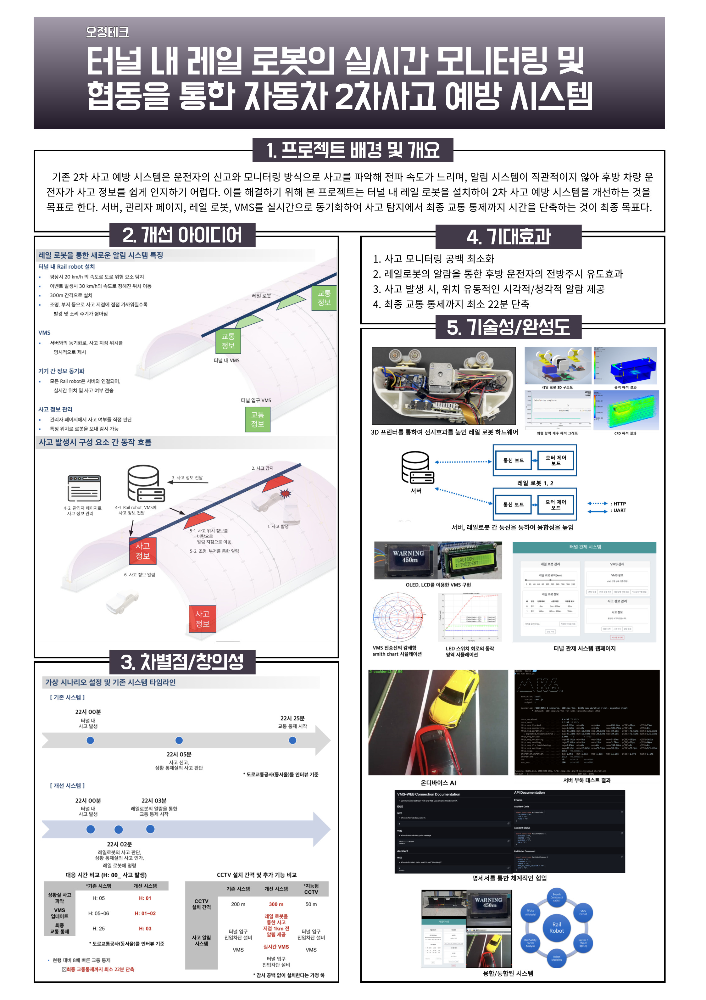
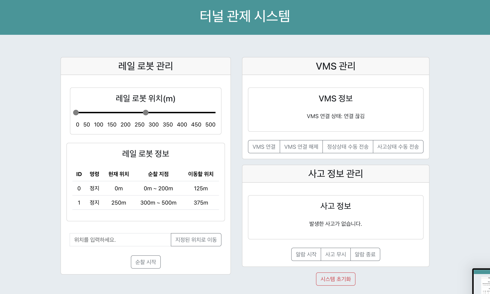

# 2024-creative-engineering-design-competition

2024년 창의공학설계 경진대회

## Summary

## Backend (./backend)

### Info

- 레일로봇, 사고 정보를 관리하는 서버입니다.
- "./backend/Readme.md"에 배포 관련 정보 및 API 명세서를 첨부하였습니다.
- (https://cedc.webserialmonitor.com/api)에 배포하였습니다.

### 기술스택

- Framework: Express
- DB: MongoDB
- Language: TypeScript
- Infra: Nginx, AWS Route53
- Test: k6

## Frontend (./frontend)

### Info

- 레일로봇, 사고 정보를 관리하는 사고 관제 시스템 웹페이지 입니다.
- "./frontend/Readme.md"에 배포 관련 정보 및 VMS-Web 통신 규격 명세서를 첨부하였습니다.
- (https://cedc.webserialmonitor.com)에 배포하였습니다.

### 기술스택

- Framework: React
- UserInterface: Bootstrap
- Language: TypeScript
- Infra: Nginx, AWS Route53

