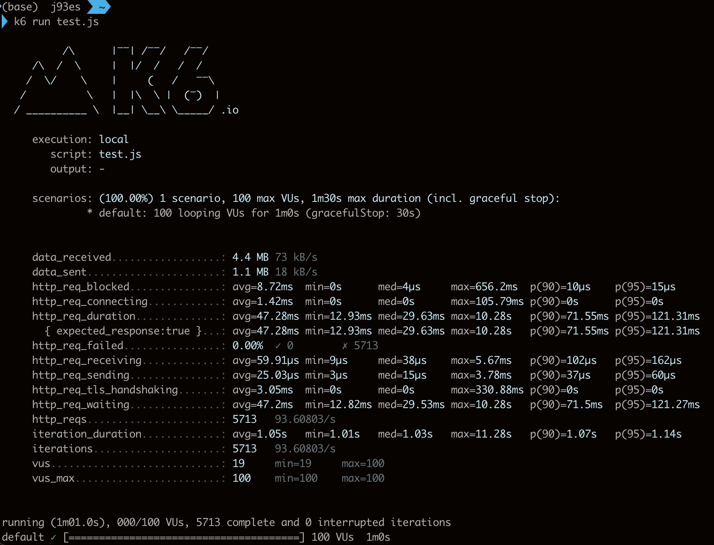
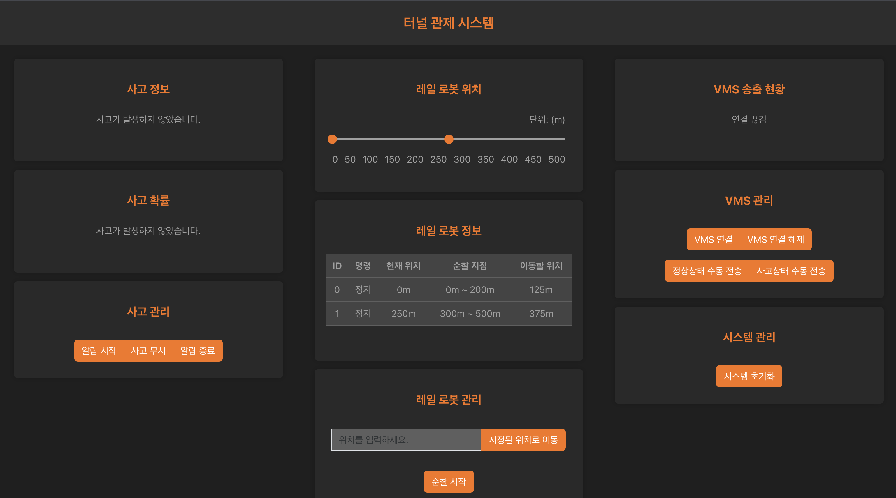

# 2024-creative-engineering-design-competition

2024년 창의공학설계 경진대회

## Summary

## Backend (./backend)

### Info

- 레일로봇, 사고 정보를 관리하는 서버입니다.
- ./backend/Readme.md 에 배포 관련 정보 및 API 명세서를 첨부하였습니다.
- https://cedc.webserialmonitor.com/api 에 배포하였습니다.(24.9.1 ~ 24.11.22)

### 기술스택

- Framework: Express
- DB: MongoDB
- Language: TypeScript
- Infra: Nginx, Cloudflare(or AWS Route53)
- Test: k6

## Frontend (./frontend)

### Info

- 레일로봇, 사고 정보를 관리하는 사고 관제 시스템 웹페이지 입니다.
- ./frontend/Readme.md 에 배포 관련 정보 및 VMS-Web 통신 규격 명세서를 첨부하였습니다.
- https://cedc.webserialmonitor.com 에 배포하였습니다.(24.9.1 ~ 24.11.22)

### 기술스택

- Framework: React
- UserInterface: Bootstrap
- Language: TypeScript
- Infra: Nginx, AWS Route53

## Frontend Version2 (./frontend-v2)

### Info

- 기존 프론트엔드 페이지에서 디자인과 세부기능을 수정하였습니다.
- 기존 AWS Route53을 사용하였으나, Cloudflare를 활용하였습니다.

### 기술스택

- Framework: React
- UserInterface: Bootstrap
- Language: TypeScript
- Infra: Nginx, Cloudflare

## Result

### 교내 대회 (./school-competition)

- 1차 심사: 6/7
- 2차 심사: 7/17
- 3차 심사: 9/12
- 최종 결과: 2위, 총장상

### 전국 대회 (./national-competition)

- 예선: 11/7(1위, 공학교육혁신센터장상)
- 본선: 11/15
- 시상식: 11/22
- 최종결과: 산업통상자원부장관상

### 보도자료

- 조선일보
  https://lifenlearning.chosun.com/pan/site/data/html_dir/2024/11/25/2024112501899.html

- 다음 중앙일보
  https://v.daum.net/v/20241126112535152

- 한겨레
  https://www.hani.co.kr/arti/economy/biznews/1169091.html

- 뉴데일리 경제
  https://biz.newdaily.co.kr/site/data/html/2024/11/25/2024112500342.html

- 네이트 뉴스
  https://m.news.nate.com/view/20241126n13581

- 베리타스 알파
  https://www.veritas-a.com/news/articleView.html?idxno=531519

- 뉴스 원
  https://www.news1.kr/society/education/5610757

- 대학 저널
  https://dhnews.co.kr/news/view/1065598961974404
